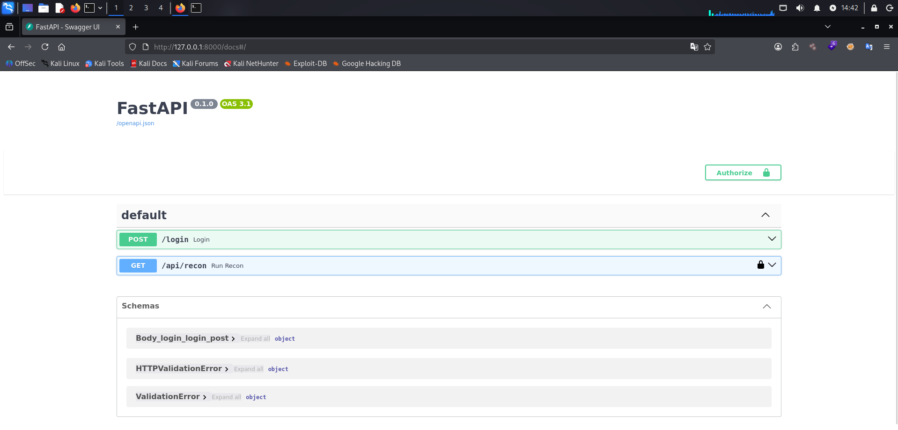
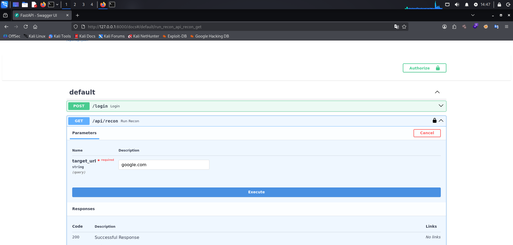
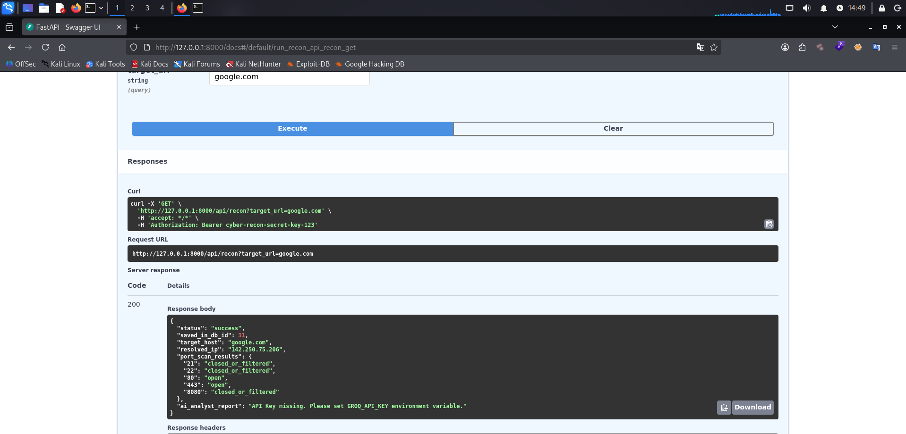

# FastAPI Cyber AI Recon Agent

A security-focused educational reconnaissance platform built with Python and FastAPI, combining asynchronous port scanning, SSRF mitigation, authentication, SQLite persistence, and LLM-assisted security analysis with a local fallback.

**Legal Notice:** This tool is intended strictly for authorized security testing, lab environments, and systems you legally own or have explicit, written permission to assess.

---

## 📐 System Architecture

```text
             ┌──────────────┐
             │    Client    │
             └──────┬───────┘
                    │
              Bearer Token
                    │
             ┌──────▼───────┐
             │   FastAPI    │
             └──────┬───────┘
                    │
            ┌───────▼────────┐
            │ Target Validator│
            │  SSRF Defense   │
            └───────┬────────┘
                    │
             ┌──────▼───────┐
             │ Port Scanner │
             └──────┬───────┘
                    │
          ┌─────────┴─────────┐
          │                   │
    ┌─────▼─────┐      ┌──────▼──────┐
    │  SQLite   │      │   Groq AI   │
    │  History  │      │   Analysis  │
    └───────────┘      └─────────────┘
```

---

## 🚀 Core Features

- Asynchronous TCP port scanning
- FastAPI REST API
- Bearer Token authentication
- SSRF mitigation with IP validation
- SQLite persistence
- LLM-assisted reconnaissance analysis using Groq
- Local fallback analysis
- Automated tests with Pytest
- Environment-based configuration

---

## 📸 Core Interface Evaluation

### 1. Secure Access Gateway (Bearer Token Authentication)
The application routing infrastructure is gated using token validation constraints.


### 2. Input Configuration & SSRF Firewall Shield
Application inputs are sanitized against Server-Side Request Forgery (SSRF) vulnerabilities to shield local assets.


### 3. Live Server Response & Automated AI Analysis Reports
Socket data is pushed into relational tables and sent to the Groq Cloud runner for threat indexing.


---

## 🔒 Security Architecture & Applied Controls

* **Modular Framework Design:** Complete separation of concerns mapping into clear architectural layers (`core/`, `database/`, `ai/`).
* **Token Gate Filter:** Critical scanner API components are blocked using a **Bearer Token Authentication** security middleware.
* **SSRF Prevention Core:** Validates target endpoints via DNS resolution checks to block internal loops (`127.0.0.1`, private IP blocks, link-local, and reserved ranges).
* **Fault-Tolerant AI Engine:** Features an automated **Local Fallback Engine** inside `ai/groq_agent.py` to handle upstream API key or cloud model failures, providing graceful degradation when the external AI service is unavailable.
* **Automated Engineering Tests:** Backed by automated tests with Pytest environment validation engine.

---

## 🚀 Quick Start Guide

### Installation Tree
```bash
git clone https://github.com
cd fastapi-cyber-ai-recon
python3 -m venv venv
source venv/bin/activate
pip install -r requirements.txt
```

### Environment Variable Profile Setup
Create a local `.env` configuration file mapping your secret access token key:
```text
GROQ_API_KEY=your_secret_groq_api_token_here
ADMIN_USERNAME=admin
ADMIN_PASSWORD=your_strong_password
API_BEARER_TOKEN=your_strong_random_token
```

### Launch Environment Run Profile
```bash
./venv/bin/uvicorn main:app --reload
```

### Running Automated Framework Validation Tests
To trigger the automated SSRF firewall testing matrix infrastructure natively:
```bash
pytest
```

